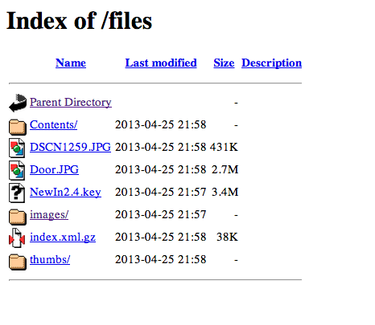

URL Mapping
===========

In this chapter, we'll discuss the various ways that the Apache http
server handles URL Mapping.

Introduction to URL Mapping
---------------------------

When the Apache http server receives a request, it is processed in a
variety of ways to see what resource it represents. This process is
called URL Mapping. 

mod\_rewrite is part of this process, but will be handled separately,
since it is a large portion of the contents of this book.

The exact order in which these steps are applied may vary from one
configuration to another, so it is important to understand not only the
steps, but the way in which you have configured your particular server.

mod_rewrite
-----------

mod\_rewrite is perhaps the most powerful part of this process. That
is, of course, why it features prominently in the name of this book.
Indeed, mod\_rewrite spans several chapters of this book, and has a Part all its own, Part \ref{partrewrite}.

For now, we'll just say that mod\_rewrite fills a variety of
different roles in the URL mapping process. It can, among other things,
modify a URL once it is received, in many different ways.

While this usually happens before the other parts of URL mapping, in
certain circumstances, it can also perform that rewriting later on in
the process. 

This, and much more, will be revealed in the coming chapters.

DocumentRoot
------------

.. index:: DocumentRoot

The `DocumentRoot` directive specifies the filesystem directory from which static content will be served. It's helpful to think of this as the default behavior of the Apache http server when no other content source is found.

Consider a configuration of the following:

::

    DocumentRoot /var/www/html

With that setting in place, a request for <http://example.com/one/two/three.html> will result in the file `/var/www/html/one/two/three.html` being served to the client with a MIME type derived from the file name - in this case, `text/html`.

The `DirectoryIndex` directive specifies what file, or files, will be served in the event that a directory is requested. For example, if you have the configuration:

::

    DocumentRoot /var/www/html
    DirectoryIndex index.html index.php

Then when the URL <http://example.com/one/two/> is requested, Apache httpd will attempt to serve the file `/var/www/html/index.html` and, if it's not able to find that, will attempt to serve the file `/var/www/html/index.php`.

If neither of those files is available, the next thing it will try to do is serve a directory index.

Directory index
---------------

.. index:: Directory index
.. index:: Autoindex
.. index:: mod_autoindex

The module `mod_autoindex` serves a file listing for any directory that doesn't contain a `DirectoryIndex` file.

To permit directory listings, you must enable the `Indexes` setting of the `Options` directive:

::

    Options +Indexes

See the documentation of the `Options` <http://httpd.apache.org/docs/current/mod/core.html#options> for further discussion of that directive.

If the `Indexes` option is on, then a directory listing will be displayed, with whatever features are enabled by the `IndexOptions` directive.

Typically, a directory will look like the example shown below.

For further discussion of the autoindex functionality, consult the `mod_autoindex` documentation at <http://httpd.apache.org/docs/current/mod/mod_autoindex.html>.

*Future versions of this book will include more detailed information about directory listings.*

Alias
-----

.. index:: Alias

The Alias directive is used to map a URL to a directory path outside of your `DocumentRoot` directory.

::

    Alias /icons /var/www/icons

An Alias is usually accompanied by a `<Directory>` stanza granting httpd permission to look in that directory. In the case of the above Alias, for example, add the following:

::

    <Directory /var/www/icons>
      Require all granted
    </Directory>

Or, if you're using httpd 2.2 or earlier:

::

    <Directory /var/www/icons>
      Order allow,deny
      Allow from all
    </Directory>

.. index:: ScriptAlias
.. index:: CGI

There's a special form of the `Alias` directive - `ScriptAlias` - which has the additional property that any file found in the referenced directory will be assumed to be a CGI program, and httpd will attempt to execute it and sent the output to the client.

CGI programming is outside of the scope of this book. You may read more about it at <http://httpd.apache.org/docs/current/howto/cgi.html>

Redirect
--------

.. index:: Redirect

The purpose of the `Redirect` directive is to cause a requested URL to result in a redirection to a different resource, either on the same website or on a different server entirely.

The `Redirect` directive results in a `Location` header, and a 30x status code, being sent to the client, which will then make a new request for the specified resource.

The exact value of the 30x status code will influence what the client does with this information, as indicated in the table below:

====  =======
Code  Meaning
----  -------
300   Multiple Choice - Several options are available
301   Moved Permanently
302   Temporary Redirect
304   Not Modified - use whatever version you have cached
====  =======

Other 30x statuses are available, but these are the only ones we'll concern ourselves with at the moment.

The syntax of the `Redirect` directive is as follows:

::

    Redirect [status] RequestedURL TargetUrl

Location
--------

Virtual Hosts
-------------

Proxying
--------

mod_actions
-----------

mod_imagemap
------------

mod_negotiation
---------------

File not found
--------------

In the event that a requested resource is not available, after all of the above mentioned methods are attempted to find it ...

